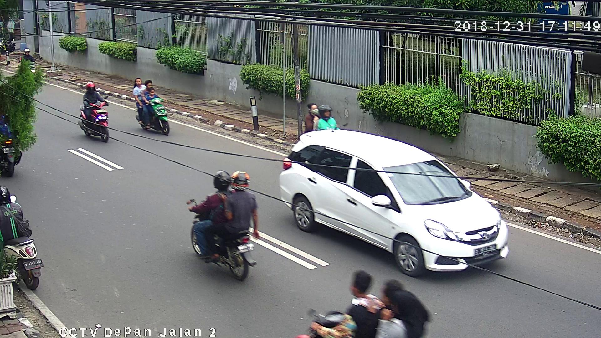
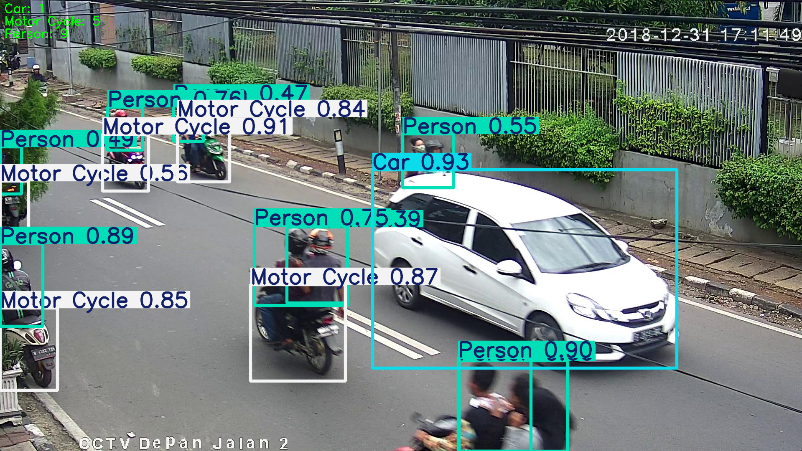

# 이동 수단의 종류와 개수 판별

이 프로젝트는 이동 수단의 종류와 개수를 판별하고, 사람을 인식하는 프로젝트입니다.
자율주행의 시대에서 가장 기초가 되는 것은 이동 수단의 종류와 개수를 판별하고 사람을 피해 다음 경로를 예측하는 것이라고 생각합니다.
따라서 이동 수단의 종류와 개수를 판별하고 사람을 인식하는 프로젝트를 수행해봤습니다.

# 실행 전

# 실행 후

# 보완 사항
차와 오토바이의 종류를 판별할 때는 꽤나 높은 정확도를 보였으나, 사람이 겹쳐있을 땐 상대적으로 사람 인식의 정확도가 낮습니다.
따라서 사람이 겹친 상황에 대한 보완 학습이 필요합니다.
그리고 오토바이가 사진에서 부분만 나온 경우에 인간은 오토바이를 인식할 수 있으나, 코드에서는 오토바이의 일부분만 보일 경우에 인식을 못했습니다.
따라서 사람이 위에 타있고, 이동수단이 정확히 보이지 않는다면 자동차는 아니므로 오토바이라는 것을 추론하도록 강화학습이 필요합니다.